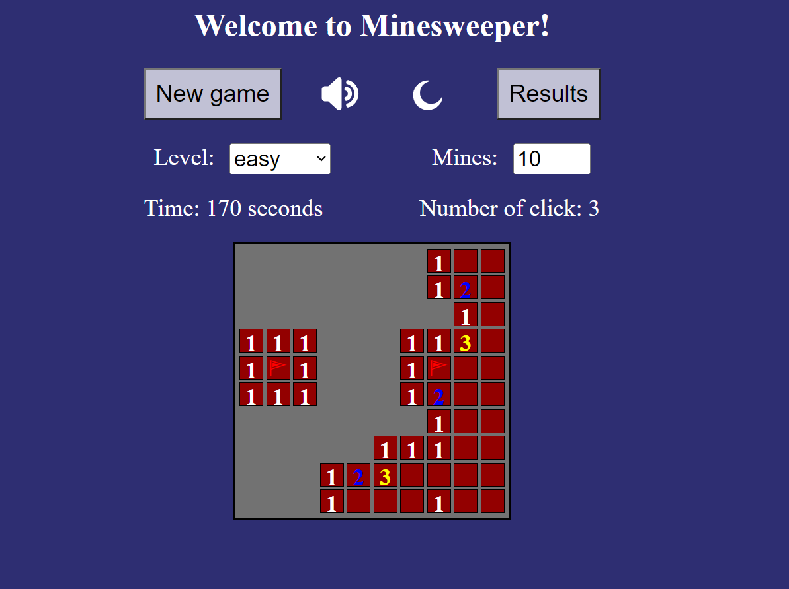

# Minesweeper

Minesweeper is a classic logic puzzle in which your task is to place flags on a minefield and avoid explosions. This version of the game is created exclusively using the JavaScript programming language, without using any libraries or frameworks.

## Technology Stack:

- JS
- JS modules
- webpack
- eslint

## Deployment

You can see the deployment of the project at [https://slavr7.github.io/minesweeper/](https://slavr7.github.io/minesweeper/)

## Installation and Usage

To run this project locally, follow these steps:

1. Clone this repository.
2. Run 'npm install'.
3. Run 'npm run serve'.

## Screenshot

## Available Scripts

- **'npm run build':** This script triggers the Webpack bundler to build your project in production mode. It sets the Node environment to production.
- **'npm run watch':** This script runs Webpack in watch mode, which continuously monitors your project files for changes and rebuilds it automatically when changes are detected.
- **'npm run serve':** This script starts a development server using Webpack's built-in development server, allowing you to preview and test your project locally.
- **'npm run lint':** This script runs ESLint, a code analysis tool, on the code located in the src directory of your project. It automatically fixes code style and syntax issues using the --fix option, ensuring that your code conforms to defined coding standards and maintains consistency.

